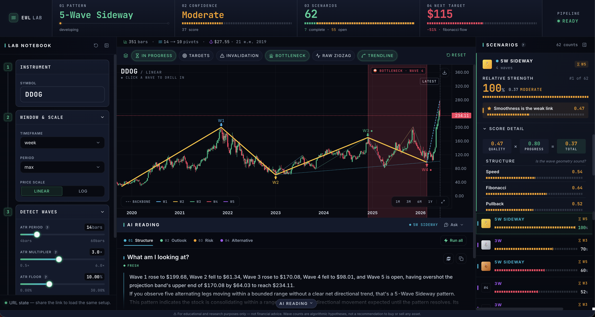
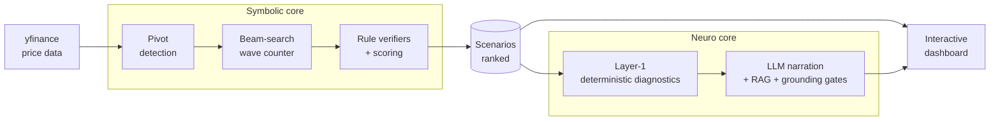
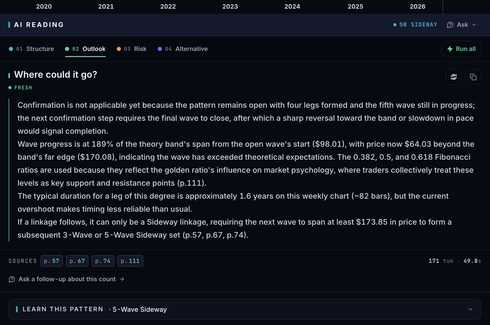
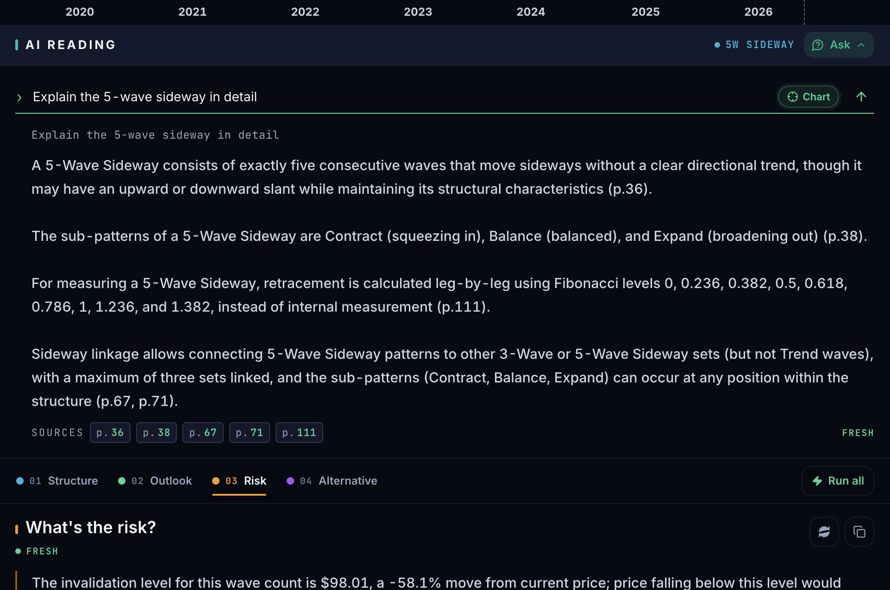

<div align="center">

# 🌊 Neuro-Symbolic AI for Elliott Wave Analysis

**Rule-based wave counting you can verify, explained by an LLM that cites the theory.**

[](https://github.com/nkieu-config/elliott-wave-ai-project/actions/workflows/ci.yml)
[](https://elliott-wave-web.vercel.app)


[Live demo](https://elliott-wave-web.vercel.app) · [Why I built this](#why-i-built-this) · [How it works](#what-happens-when-you-analyze-one-chart) · [Quick start](#quick-start) · [Documentation](#documentation)

**A full-stack Elliott Wave analysis system built solo as my computer-science senior project.** A symbolic engine counts waves with explicit, auditable rules; a deterministic diagnostics layer computes every target and risk figure; and an LLM analyst narrates the result — structurally prevented from inventing numbers or citations.

**1,268 automated tests · ≈92% branch coverage · 500-wide beam search · 98-page cited theory corpus · 5 grounding gates · ~37k lines of Python + TypeScript**

_Senior Project · Department of Computer Science, Thammasat University_

</div>

---

<p align="center">
  
</p>
<p align="center">
  <sub><b>Dashboard</b> — wave overlay on the price chart, ranked scenarios with score breakdowns</sub>
</p>

## Try it in 60 seconds

**🔗 Live demo: [elliott-wave-web.vercel.app](https://elliott-wave-web.vercel.app)** — no signup, no key needed.

1. The default chart loads with the top-ranked wave count already overlaid. **Click any wave label** to drill into its sub-waves.
2. Open a scenario's **score breakdown** to see exactly which structural rule is its weakest link — every count comes with a per-rule pass/fail trail.
3. Open **AI Reading** and watch four lenses (Structure / Outlook / Risk / Alternative) stream in — every claim carries a theory-page citation you can inspect.

> [!NOTE]
> The demo runs on free tiers (frontend on Vercel, API on Render), so the first request after the API idles can take up to a minute to wake, and the first analysis of a not-yet-cached symbol fetches live market data before it renders. **Ask** (free-form theory Q&A) needs a ~440MB embedding model that doesn't fit the free tier — [run the stack locally](#quick-start) to try it.

> [!IMPORTANT]
> **Not financial advice.** This is an educational / research project. Wave counts are algorithmic hypotheses and the AI narration is auto-generated — nothing here is investment advice.

## Why I built this

**Elliott Wave analysis has a trust problem.** Two analysts can label the same chart with two different wave counts, and most charting tools hand you _their_ count with no way to check how they got there. I wanted to know: can wave counting be made **auditable** — something you can inspect, question, and verify — instead of something you take on faith?

**The first half of the answer is symbolic.** I built a wave-counting engine from scratch that treats Elliott Wave theory as an explicit grammar: an ATR-adaptive ZigZag detects pivots, a beam search explores hundreds of competing wave hypotheses at once, and rule verifiers check each one against the theory's actual rules. Every scenario the system ranks comes with a per-rule pass/fail trail and a score breakdown — you can always see _why_ a count scored the way it did.

**The second half is the hard part.** Rule outputs and score components are precise but unreadable — so I added an LLM analyst to narrate them. That immediately creates a worse problem than the one I started with: an LLM that invents numbers or misquotes theory in a financial context destroys the auditability I built the engine for.

The rule I held myself to: **everything numeric is computed deterministically, and the LLM is only allowed to narrate.** That one rule drove most of the architecture below — down to a per-request JSON schema that makes citing an unretrieved theory page _structurally impossible_ rather than merely checked after the fact.

## What happens when you analyze one chart

1. The frontend requests an analysis; the API pulls price bars from yfinance — or from a parquet cache whose per-timeframe TTL is set _below_ one bar period, so a still-forming bar always refreshes.
2. The **symbolic engine** takes over: a causal ATR ZigZag finds pivots (no look-ahead — the last bar is still forming), then a beam search (width 500) grows hundreds of competing wave hypotheses over a recursive grammar — waves contain waves.
3. **Rule verifiers** grade every hypothesis against the theory's actual rules (wave-3 never the shortest, retracement depth caps, alternation, degree proportionality), and **weakest-link scoring** ranks them: a count can't buy its way past one broken property with excellence elsewhere.
4. A **deterministic diagnostics layer** computes every number the user will ever see — price targets, confirmation and invalidation levels, risk-reward, which scoring slot is the bottleneck. No LLM yet.
5. Only now does the **LLM narrate** that pre-computed block, streamed over SSE across four lenses — constrained by typed claims, a per-request citation enum of only the retrieved theory pages, a verbatim-number check against step 4, and a citation gate that falls back to deterministic text rather than ship a suspect reading.



Because every number the narration mentions must appear verbatim in the deterministic layer, **the chart, the count, the confidence score, and the AI's explanation all trace back to something you can verify.**

Full deep-dive — beam-search design, scoring model, the five anti-hallucination layers, caching strategy, SSE streaming: **[docs/ARCHITECTURE.md](docs/ARCHITECTURE.md)**.

## Feature tour

| Feature               | What it does                                                                                                                                                                           |
| --------------------- | -------------------------------------------------------------------------------------------------------------------------------------------------------------------------------------- |
| **Wave engine**       | ATR-adaptive ZigZag pivots, 500-wide beam search over a recursive wave grammar, explicit per-rule pass/fail verifiers, Gann-band degree gating                                         |
| **Scenario explorer** | Ranked wave hypotheses with score breakdowns, weakest-link bottleneck callout, side-by-side comparison of what separates the top counts                                                |
| **Interactive chart** | Wave overlay with click-to-drill into sub-waves, Fibonacci / confirmation / invalidation price lines, log-linear toggle, zoom preserved across re-renders                              |
| **AI Reading**        | Four narration lenses (Structure / Outlook / Risk / Alternative) streamed in parallel over SSE, every claim cited to a theory page                                                     |
| **Ask**               | `/`-hotkey free-form Elliott Wave Q&A over the 98-page theory corpus, with citation chips and an out-of-scope gate that refuses off-topic questions — [self-hosted only](#quick-start) |
| **Shareable state**   | Selected scenario, drill path, compare mode, and chart layers all live in the URL — sharing a link reproduces the exact chart configuration                                            |
| **Data layer**        | yfinance fetch with retry, parquet cache with per-timeframe TTLs and an LRU byte budget                                                                                                |

<p align="center">
  
</p>
<p align="center">
  <sub><b>AI Reading</b> — streamed narration across four lenses, every claim cites the theory</sub>
</p>

<p align="center">
  
</p>
<p align="center">
  <sub><b>Ask</b> — free-form theory Q&A, answered from the corpus with citations</sub>
</p>

## Engineering decisions I'd defend in an interview

- **The LLM is never allowed to compute** — every target, invalidation level, and risk figure comes from a deterministic diagnostics layer; the LLM only narrates that block, and five independent gates verify it did exactly that.
- **Citing an unretrieved page is structurally impossible** — the JSON schema's citation field is generated per-request as an enum of only the pages the retriever actually supplied. The constraint acts at decode time, not as an after-the-fact check.
- **Weakest-link scoring over weighted sums** — each hypothesis scores as the minimum of its structural and visual slots, the same way a human analyst discards a count with a single fatal flaw instead of averaging it away.
- **Measured performance work, not guessed** — profiling found `copy.deepcopy` at 94% of beam-search wall time; targeted shallow cloning, `slots=True` dataclasses (100k+ allocations per long chart), and a hot/verbose scoring split brought long-chart analysis to interactive speed.
- **Caching correctness treated as a feature** — content-derived LLM cache keys that survive UUID regeneration, a source+corpus fingerprint that invalidates narrations when the embedding model changes, atomic writes, and the discipline of never caching a degraded failover response.
- **Honest streaming UX** — SSE narration paces tokens for live generations but skips the typewriter for cache hits, and reports real LLM wall time. The UI never fakes a live model.
- **The architecture is a CI failure, not a convention** — an import-linter contract pins `apps → infra → analyst → engine`; any upward import fails CI. The inner layers declare Protocols (`BarSource`, `LLMClient`), `infra/` supplies the adapters, and pandas never crosses into the engine.
- **Production-minded hardening** — fail-fast startup when production is configured without a CORS allowlist, a force-refresh guard against LLM-cost abuse, cloud-concurrency throttling, and automatic Ollama cloud→local failover triggered only by curated transport errors, so programming errors still surface as bugs.

Each of these is expanded with the reasoning and trade-offs in [docs/ARCHITECTURE.md](docs/ARCHITECTURE.md) and [docs/TRADEOFFS.md](docs/TRADEOFFS.md).

## Tech stack

| Layer                         | Technology                                    | Responsibility                                                                    |
| ----------------------------- | --------------------------------------------- | --------------------------------------------------------------------------------- |
| **Symbolic core** (`engine/`) | Python, pandas                                | Detect pivots (ZigZag/ATR) → count waves via beam search → verify rules → score   |
| **Neuro core** (`analyst/`)   | Ollama Cloud (LLM) + RAG, numpy               | Explain scenarios + answer theory Q&A in plain language, citing the theory corpus |
| **Backend** (`apps/api/`)     | FastAPI + uvicorn                             | REST API + SSE narration stream + theory Q&A                                      |
| **Frontend** (`apps/web/`)    | Next.js 15 + React 19 + Lightweight Charts v5 | Interactive dashboard                                                             |
| **Testing & CI**              | pytest, Vitest, ruff, import-linter           | 1,268 tests, coverage gate, enforced layering, dependency audits                  |

## Quick start

**Docker (recommended)** — the whole stack in one command:

```bash
git clone https://github.com/nkieu-config/elliott-wave-ai-project.git
cd elliott-wave-ai-project
docker compose up --build
```

Then open the **dashboard at http://localhost:3000** (API docs at http://localhost:8000/docs).

> [!NOTE]
> AI Reading needs an Ollama Cloud key (chart / scoring / KPI work without one). Compose
> reads `OLLAMA_API_KEY` from your shell or the project `.env`:
>
> ```bash
> export OLLAMA_API_KEY=<your key>   # or: cp .env.example .env && edit it
> docker compose up --build
> ```
>
> **Ask** also needs the embedder — `ANALYST_QA=1` plus the `grounding` extra (pulls ~440MB of
> torch), so it's off in the compose image. Use the local path below to try it.

**Local (uv + npm)** — Python ≥3.11, Node ≥20:

```bash
uv sync --extra api                                      # add --extra grounding to enable Ask
cp .env.example .env                                     # add OLLAMA_API_KEY for AI features
uv run uvicorn apps.api.main:app --reload --port 8000    # API on :8000
cd apps/web && npm install && npm run dev                # UI on :3000
```

The full local guide — usage walkthrough, testing, environment-variable reference, directory tree: **[docs/DEVELOPMENT.md](docs/DEVELOPMENT.md)**.

## Testing & CI

**1,268 tests** — 1,109 Python (pytest, mirroring the source structure: per-verifier, per-scoring-slot, per-diagnostic, plus parity tests that pin engine/gate/web behavior to each other) and 159 web (Vitest: chart helpers, SSE parsing, narration stream, stores). Branch coverage is **gated at ≥75% in CI (actual ≈92%)**.

```bash
uv run pytest                # Python suite (add -m "not slow" for the fast subset)
cd apps/web && npm test      # web suite
```

Every push and PR runs [CI](.github/workflows/ci.yml) across three jobs, with Actions SHA-pinned:

- **Python 3.11 + 3.12 matrix** — `ruff`, the import-linter architecture contract, `pytest` with the coverage gate, and a `pip-audit` vulnerability scan.
- **Web** — `tsc`, `eslint`, **`next build`** (catches RSC/static-generation failures type checks miss), Vitest, and `npm audit`.
- **Docker** — builds both compose images, so the README's own quick-start command breaks CI instead of a first-time user.

On push to `main`, Vercel rebuilds the frontend and Render rebuilds the API image — a commit reaches the live demo with no manual deploy step. Topology and scaling notes: [docs/DEPLOYMENT.md](docs/DEPLOYMENT.md).

## Documentation

| Document                                        | What's inside                                                                      |
| ----------------------------------------------- | ---------------------------------------------------------------------------------- |
| [ARCHITECTURE.md](docs/ARCHITECTURE.md)         | Deep dive: engine internals, anti-hallucination design, caching, streaming, web UI |
| [DEVELOPMENT.md](docs/DEVELOPMENT.md)           | Local setup, usage guide, testing, environment variables, directory tree           |
| [DEPLOYMENT.md](docs/DEPLOYMENT.md)             | Vercel + Render deployment, scaling notes, security checklist                      |
| [TRADEOFFS.md](docs/TRADEOFFS.md)               | Design tradeoffs and known limitations, and why each was accepted                  |
| [Theory corpus](docs/elliott_wave_theory_en.md) | The Elliott Wave theory document the RAG analyst retrieves and cites from          |

## Honest limitations

Deliberate scope choices for a portfolio-scale deployment — each with its full reasoning in [docs/TRADEOFFS.md](docs/TRADEOFFS.md):

- **The LLM can never improve the count, only explain it.** Auditability was chosen over end-to-end learning: a neural counter might read ambiguous charts better, but it would forfeit the per-rule pass/fail trail that is this project's whole point.
- **"Every claim cites theory" is a structural guarantee, not a semantic one.** No claim can cite a page that wasn't retrieved; whether the page's _content_ supports the claim is checked only by an opt-in advisory embedding pass, off in the default deployment.
- **Single-process caches, one worker.** The parquet, LLM-response, and wave-count caches live in-process — simple and correct for the deployment's single worker. Scaling out needs Redis; the seams are already behind interfaces.
- **yfinance is the sole data source** — unofficial and best-effort, but key-free for a demo, and hidden behind a `BarSource` Protocol so a licensed feed can replace it without touching the engine.
- **No app-level auth or rate limiting** — the live demo bounds cost through CORS, a force-refresh guard, and caching; anything beyond a demo audience wants a rate limiter in front.

## About

Built solo by [Natthachak (@nkieu-config)](https://github.com/nkieu-config) — engine, analyst, API, frontend, tests, CI, and deployment.

| Project info     |                                                                                       |
| ---------------- | ------------------------------------------------------------------------------------- |
| **Project Code** | 68-1_24_pps-r1                                                                        |
| **Title (TH)**   | ระบบปัญญาประดิษฐ์แบบนิวโร-ซิมบอลิกเพื่อการวิเคราะห์โครงสร้างตลาดตามทฤษฎีคลื่นเอลเลียต |
| **Title (EN)**   | A Neuro-Symbolic AI System for Market Structure Analysis Based on Elliott Wave Theory |
| **Author**       | Mr. Natthachak Jeungraksareechai                                                      |
| **Advisor**      | Asst. Prof. Dr. Pokpong Songmuang                                                     |

Developed as a final project for the Department of Computer Science, Thammasat University.

## License

© 2026 Natthachak Jeungraksareechai — all rights reserved. See [LICENSE](LICENSE).
