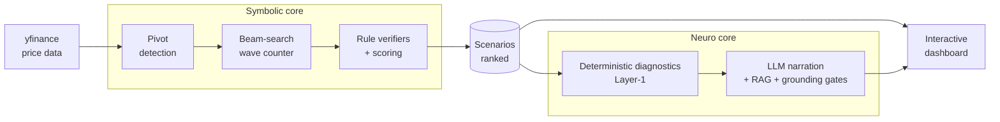

<div align="center">

# 🌊 Neuro-Symbolic AI for Elliott Wave Analysis

**Rule-based wave counting you can verify, explained by an LLM that cites the theory.**

[](https://github.com/nkieu-config/elliott-wave-engine/actions/workflows/ci.yml)
[](https://elliott-wave-web.vercel.app)
[](LICENSE)


[Live demo](https://elliott-wave-web.vercel.app) · [Why I built this](#why-i-built-this) · [How it works](#what-happens-when-you-analyze-one-chart) · [Quick start](#quick-start) · [Documentation](#documentation)

**A full-stack Elliott Wave analysis system built solo as my computer-science senior project.** A symbolic engine counts waves with explicit, auditable rules; a deterministic diagnostics layer computes every target and risk figure; and an LLM analyst narrates the result — structurally prevented from inventing numbers or citations.

**1,318 automated tests · ≈92% branch coverage · 98-page cited theory corpus · 5 grounding gates · ~39k lines of Python + TypeScript**

_Senior Project · Department of Computer Science, Thammasat University_

</div>

---

<p align="center">
  
</p>
<p align="center">
  <sub><b>40-second tour</b> — invalidation and bottleneck overlays, drilling into sub-waves, the per-rule score breakdown, and the AI reading streaming live with theory citations</sub>
</p>

## Try it in 60 seconds

**🔗 Live demo: [elliott-wave-web.vercel.app](https://elliott-wave-web.vercel.app)** — no signup, no key needed.

1. The default chart loads with the top-ranked wave count already overlaid. **Click any wave label** to drill into its sub-waves.
2. Open a scenario's **score breakdown** to see exactly which structural rule is its weakest link — every count comes with a per-rule pass/fail trail.
3. Open **AI Reading** and watch four lenses (Structure / Outlook / Risk / Alternative) stream in — each theory claim carries a page citation you can inspect, and the schema makes citing an unretrieved page impossible.

> [!NOTE]
> The demo runs on free tiers (frontend on Vercel, API on Render), so expect some waiting on a cold path: the API takes up to a minute to wake after it idles, the first analysis of a not-yet-cached symbol fetches live market data before it renders, and an uncached **AI Reading** takes **around two minutes** for all four lenses — they stream in parallel and each appears the moment it lands, but `gpt-oss:120b` is genuinely slow at this length. Cached readings return instantly. **Ask** (free-form theory Q&A) needs a ~440MB embedding model that doesn't fit the free tier — [run the stack locally](#quick-start) to try it.

> [!IMPORTANT]
> **Not financial advice.** This is an educational / research project. Wave counts are algorithmic hypotheses and the AI narration is auto-generated — nothing here is investment advice.

## Why I built this

**Elliott Wave analysis has a trust problem.** Two analysts can label the same chart with two different wave counts, and most charting tools hand you _their_ count with no way to check how they got there. I wanted to know: can wave counting be made **auditable** — something you can inspect, question, and verify — instead of something you take on faith?

**The first half of the answer is symbolic.** I built a wave-counting engine from scratch that treats Elliott Wave theory as an explicit grammar: an ATR-adaptive ZigZag detects pivots, a beam search explores hundreds of competing wave hypotheses at once, and rule verifiers check each one against the theory's actual rules. Every scenario the system ranks comes with a per-rule pass/fail trail and a score breakdown — you can always see _why_ a count scored the way it did.

**The second half is the hard part.** Rule outputs and score components are precise but unreadable — so I added an LLM analyst to narrate them. That immediately creates a worse problem than the one I started with: an LLM that invents numbers or misquotes theory in a financial context destroys the auditability I built the engine for.

The rule I held myself to: **everything numeric is computed deterministically, and the LLM is only allowed to narrate.** That one rule drove most of the architecture below — down to a per-request JSON schema that makes citing an unretrieved theory page _structurally impossible_ rather than merely checked after the fact.

## What happens when you analyze one chart

1. The frontend requests an analysis; the API pulls price bars from yfinance — or from a parquet cache whose per-timeframe TTL is set _below_ one bar period, so a still-forming bar always refreshes.
2. The **symbolic engine** takes over: a causal ATR ZigZag finds pivots (no look-ahead — the last bar is still forming), then a beam search (width 500) grows hundreds of competing wave hypotheses over a recursive grammar — waves contain waves.
3. **Rule verifiers** grade every hypothesis against the theory's actual rules (wave-3 never the shortest, retracement depth caps, alternation, degree proportionality), and **weakest-link scoring** ranks them: a count can't buy its way past one broken property with excellence elsewhere.
4. A **deterministic diagnostics layer** computes every number the user will ever see — price targets, confirmation and invalidation levels, risk-reward, which scoring slot is the bottleneck. No LLM yet.
5. Only now does the **LLM narrate** that pre-computed block, streamed over SSE across four lenses — constrained by typed claims, a per-request citation enum of only the retrieved theory pages, a verbatim-number check against step 4, and a citation gate that falls back to deterministic text rather than ship a suspect reading.



Because every number the narration mentions must appear verbatim in the deterministic layer, **the chart, the count, the confidence score, and the AI's explanation all trace back to something you can verify.**

Want to see it on a real chart first? **[docs/examples.md](docs/examples.md)** walks through four of them — a nested count, a fully-verified rule trail, a chart the engine scores at 0.0009, and 45 years of AAPL it refuses to count at all.

Full deep-dive — beam-search design, scoring model, the five grounding gates, caching strategy, SSE streaming: **[docs/architecture.md](docs/architecture.md)**.

## Feature tour

| Feature               | What it does                                                                                                                                                                           |
| --------------------- | -------------------------------------------------------------------------------------------------------------------------------------------------------------------------------------- |
| **Wave engine**       | ATR-adaptive ZigZag pivots, 500-wide beam search over a recursive wave grammar, explicit per-rule pass/fail verifiers, Gann-band degree gating                                         |
| **Scenario explorer** | Ranked wave hypotheses with score breakdowns, weakest-link bottleneck callout, side-by-side comparison of what separates the top counts                                                |
| **Interactive chart** | Wave overlay with click-to-drill into sub-waves, Fibonacci / confirmation / invalidation price lines, log-linear toggle, zoom preserved across re-renders                              |
| **AI Reading**        | Four narration lenses (Structure / Outlook / Risk / Alternative) streamed over SSE, each theory claim cited to a corpus page it was actually retrieved from                            |
| **Ask**               | `/`-hotkey free-form Elliott Wave Q&A over the 98-page theory corpus, with citation chips and an out-of-scope gate that refuses off-topic questions — [self-hosted only](#quick-start) |
| **Shareable state**   | Selected scenario, drill path, compare mode, and chart layers all live in the URL — sharing a link reproduces the exact chart configuration                                            |
| **Data layer**        | yfinance fetch with retry, parquet cache with per-timeframe TTLs and an LRU byte budget                                                                                                |

<p align="center">
  
</p>
<p align="center">
  <sub><b>Dashboard</b> — wave overlay on the price chart, ranked scenarios with score breakdowns</sub>
</p>

| AI Reading                                                                                        | Ask                                                                              |
| ------------------------------------------------------------------------------------------------- | -------------------------------------------------------------------------------- |
|  |  |

## Engineering decisions I'd defend in an interview

- **The LLM is never allowed to compute** — every target, invalidation level, and risk figure comes from a deterministic diagnostics layer (Layer-1); the LLM only narrates that block, and five grounding gates verify it did exactly that.
- **The UI never pretends the model is live** — streamed narration skips the typewriter effect for cache hits and reports real LLM wall time, so the interface never fakes a streaming model.
- **Citing an unretrieved page is structurally impossible** — the JSON schema's citation field is generated per-request as an enum of only the pages the retriever actually supplied. The constraint acts at decode time, not as an after-the-fact check.
- **Weakest-link scoring over weighted sums** — each hypothesis scores as the minimum of its structural and visual slots, the same way a human analyst discards a count with a single fatal flaw instead of averaging it away.
- **Measured performance work, not guessed** — profiling found `copy.deepcopy` at 94% of beam-search wall time; targeted shallow cloning, `slots=True` dataclasses (100k+ allocations per long chart), and a hot/verbose scoring split are what keep it interactive. Today the longest chart in the demo set — AAPL weekly, 2,379 bars back to 1980 — analyzes cold in **~3.1s**, and its memoized repeat in **~2ms** (Apple M4, cached bars, beam width 500).
- **Cache correctness under real conditions** — content-derived LLM cache keys that survive UUID regeneration, a corpus fingerprint that invalidates narrations when the embedding model changes, atomic tempfile+rename writes, and the discipline of never caching a degraded failover response.
- **Guardrails that keep bugs visible** — fail-fast startup when production lacks a CORS allowlist, a force-refresh guard against LLM-cost abuse, and cloud→local failover triggered only by curated transport errors, so a programming error surfaces as a bug instead of being absorbed by the fallback.
- **The architecture is a CI failure, not a convention** — an import-linter contract pins `apps → infra → analyst → engine`; any upward import fails CI. The inner layers declare Protocols (`BarSource`, `LLMClient`), `infra/` supplies the adapters, and pandas never crosses into the engine.

Each of these is expanded with the reasoning and trade-offs in [docs/architecture.md](docs/architecture.md) and [docs/tradeoffs.md](docs/tradeoffs.md).

## Tech stack

| Layer                         | Technology                                    | Responsibility                                                                    |
| ----------------------------- | --------------------------------------------- | --------------------------------------------------------------------------------- |
| **Symbolic core** (`engine/`) | Python, pandas                                | Detect pivots (ZigZag/ATR) → count waves via beam search → verify rules → score   |
| **Neuro core** (`analyst/`)   | Ollama Cloud (LLM) + RAG, numpy               | Explain scenarios + answer theory Q&A in plain language, citing the theory corpus |
| **Backend** (`apps/api/`)     | FastAPI + uvicorn                             | REST API + SSE narration stream + theory Q&A                                      |
| **Frontend** (`apps/web/`)    | Next.js 15 + React 19 + Lightweight Charts v5 | Interactive dashboard                                                             |
| **Testing & CI**              | pytest, Vitest, ruff, import-linter           | Full suite, coverage gates, enforced layering, dependency audits                  |

## Quick start

**Docker (recommended)** — the whole stack in one command:

```bash
git clone https://github.com/nkieu-config/elliott-wave-engine.git
cd elliott-wave-engine
docker compose up --build
```

Then open the **dashboard at http://localhost:3000** (API docs at http://localhost:8000/docs).

> [!NOTE]
> AI Reading needs an Ollama Cloud key (chart / scoring / KPI work without one). Compose
> reads `OLLAMA_API_KEY` from your shell or the project `.env`:
>
> ```bash
> export OLLAMA_API_KEY=<your key>   # or: cp .env.example .env && edit it
> docker compose up --build
> ```
>
> **Ask** also needs the embedder — `ANALYST_QA=1` plus the `grounding` extra (pulls ~440MB of
> torch), so it's off in the compose image. Use the local path below to try it.

**Local (uv + npm)** — Python ≥3.11, Node ≥22, in two terminals:

```bash
# Terminal 1 — API on :8000
uv sync --extra api          # add --extra grounding to enable Ask
cp .env.example .env         # add OLLAMA_API_KEY for AI features
uv run uvicorn apps.api.main:app --reload --port 8000
```

```bash
# Terminal 2 — UI on :3000
cd apps/web && npm install && npm run dev
```

Prefer the raw engine output? One call returns the ranked scenarios, their rule trails, and the deterministic diagnostics as JSON:

```bash
curl -s -X POST http://localhost:8000/api/v1/pipeline \
  -H 'Content-Type: application/json' \
  -d '{"symbol":"AAPL","timeframe":"day","period":"2y"}'
```

The full local guide — usage walkthrough, [calling the API directly](docs/development.md#calling-the-api-directly) (with real response shapes), testing, environment-variable reference, directory tree: **[docs/development.md](docs/development.md)**.

<details>
<summary><b>Troubleshooting</b> — the five things that actually go wrong</summary>

<br>

**"The chart renders, but there are no scenarios."** Not a crash — the engine genuinely found no wave count that survives its rules, and it says which failure it hit. Almost always the analysis window is too wide: `AAPL` at `week` / `max` asks the engine to fit 45 years of history to one structure anchored at the 1982 low, and nothing legal fits. Narrow the range and counts reappear. Walked through in full, with the actual numbers: [examples.md](docs/examples.md#4-aapl-weekly--max--when-the-system-produces-nothing).

**"AI Reading falls back to plain text / says the model is unavailable."** No `OLLAMA_API_KEY`, or the key is rejected. The analyst fails over to a local Ollama model if one is running, and to deterministic Layer-1 text if not — the chart, scoring, and KPIs never need an LLM at all.

**"Ask returns 503."** Expected unless you opted in: it needs `ANALYST_QA=1` **and** the embedder (`uv sync --extra api --extra grounding`, ~440MB of torch). `GET /api/ready` reports `qa_enabled` so you can confirm which mode you're in. The Docker image ships without it deliberately.

**"The first analysis takes forever."** The first request for an uncached symbol fetches live bars from yfinance before anything else runs. Subsequent loads read the parquet cache under `data/` and are instant. On the hosted demo, add the Render free-tier cold start (up to a minute).

**"Docker doesn't see my API key."** Compose reads `OLLAMA_API_KEY` from your shell environment or the project `.env` — not from `apps/api/.env`. Export it, or `cp .env.example .env` at the repo root.

</details>

## Testing & quality

The suite splits into **1,147 Python tests** (pytest — per-verifier, per-scoring-slot, per-diagnostic, mirroring the source structure, plus parity tests that pin engine, gate, and web behavior to each other) and **171 web tests** (Vitest — chart helpers, SSE parsing, narration stream, stores).

Two coverage gates run in CI. Python branch coverage is **gated at ≥75% (actual ≈92%)** across the whole source tree. The web gate is **≥78% on the logic modules** — `lib/` plus the non-component helpers — which is where the frontend's logic deliberately lives; the React components themselves are presentational and are not counted in that denominator.

```bash
uv run pytest                # Python suite (add -m "not slow" for the fast subset)
cd apps/web && npm test      # web suite
```

## CI/CD

Every push and PR runs [CI](.github/workflows/ci.yml) across three jobs, with Actions SHA-pinned:

- **Python 3.11 + 3.12 matrix** — `ruff`, `mypy` (clean across `engine/`, `analyst/`, `infra/`, `apps/`), the import-linter architecture contract, `pytest` with the coverage gate, and a `pip-audit` vulnerability scan.
- **Web** — `tsc`, `eslint`, **`next build`** (catches RSC/static-generation failures type checks miss), Vitest, and `npm audit`.
- **Docker** — builds both compose images, so the README's own quick-start command breaks CI instead of a first-time user.

On push to `main`, Vercel rebuilds the frontend and Render rebuilds the API image — a commit reaches the live demo with no manual deploy step. Topology and scaling notes: [docs/development.md](docs/development.md#deploying-frontend-vercel).

## Documentation

**Reviewing this project? Pick a path by how much time you have:**

- **1 minute** — watch the 40-second GIF at the top, then click the [live demo](https://elliott-wave-web.vercel.app).
- **5 minutes** — [docs/examples.md](docs/examples.md): real engine output on four charts, including the one it scores near-zero and the one it refuses to count at all.
- **15 minutes** — [docs/architecture.md](docs/architecture.md): how the beam search, the scoring model, and the five grounding gates actually work. It opens with [the eight files worth reading](docs/architecture.md#where-to-start-reading), if you'd rather go straight to the code.
- **Interviewing me** — [docs/tradeoffs.md](docs/tradeoffs.md): every decision above, the alternative it beat, and what the measurement said.

| Doc                                     | What's inside                                                                      |
| --------------------------------------- | ---------------------------------------------------------------------------------- |
| [architecture.md](docs/architecture.md) | Deep dive: engine internals, the grounding gates, caching, streaming, web UI       |
| [examples.md](docs/examples.md)         | Real output on four charts — the good, the low-confidence, and the empty result    |
| [development.md](docs/development.md)   | Local setup, testing, env vars, deploying to Vercel + Render, security checklist   |
| [tradeoffs.md](docs/tradeoffs.md)       | Every design decision, the alternative it beat, and the cost it carries            |

## Honest limitations

Deliberate scope choices for a portfolio-scale deployment — each with its full reasoning in [docs/tradeoffs.md](docs/tradeoffs.md):

- **The LLM can never improve the count, only explain it.** Auditability was chosen over end-to-end learning: a neural counter might read ambiguous charts better, but it would forfeit the per-rule pass/fail trail that is this project's whole point.
- **The output is auditable, not benchmarked.** There is no labeled dataset of "correct" wave counts to score against — expert analysts disagree on the same chart, which is the premise the project starts from. What I can show is that the system is honest about its own confidence: [examples.md](docs/examples.md) walks through a chart it scores at **0.0009** and one where it returns **no count at all**, and explains why each is the right answer.
- **Citations are a structural guarantee, not a semantic one — and they attach to theory claims only.** The schema types every sentence as either a `data_observation` (a number that must appear verbatim in the deterministic layer) or a `theory_claim` (which must cite a retrieved page), so citing a page the retriever never supplied is impossible. Two honest consequences: a lens whose draft comes back as data observations only will show no citation chips at all, and whether a cited page's _content_ genuinely supports the claim is checked only by an opt-in advisory embedding pass, off in the default deployment.
- **Single-process caches, one worker.** The parquet, LLM-response, and wave-count caches live in-process — simple and correct for the deployment's single worker. Scaling out needs Redis; the seams are already behind interfaces.
- **yfinance is the sole data source** — unofficial and best-effort, but key-free for a demo, and hidden behind a `BarSource` Protocol so a licensed feed can replace it without touching the engine.
- **No app-level auth or rate limiting** — the demo's real risk is cost, not access, so it's bounded by CORS, a force-refresh guard, and caching rather than a login wall between a reviewer and the thing they came to see. Anything past a demo audience wants a rate limiter in front — see the [security checklist](docs/development.md#security-checklist).

## Resources

The theory this implements, and the load-bearing pieces of the stack:

- **[The theory corpus](analyst/theory/corpus/elliott_wave_theory_en.md)** — the 98-page Elliott Wave document the analyst retrieves and cites from. Every citation in the UI resolves to a page in this file.
- **[Ollama](https://ollama.com)** — the LLM runtime. Cloud for the primary model, local for the failover; [get a key](https://ollama.com/settings/keys).
- **[Lightweight Charts](https://tradingview.github.io/lightweight-charts/)** — the charting library the wave overlay, drill interaction, and price lines are drawn on.
- **[import-linter](https://import-linter.readthedocs.io)** — what turns the `apps → infra → analyst → engine` layering from a convention into a CI failure.
- **[uv](https://docs.astral.sh/uv/)** — Python toolchain; `uv.lock` pins the whole dependency graph.

## About

Built solo by [Natthachak (@nkieu-config)](https://github.com/nkieu-config) — engine, analyst, API, frontend, tests, CI, and deployment.

📫 natthachak.config@gmail.com · [LinkedIn](https://www.linkedin.com/in/natthachak) · [GitHub](https://github.com/nkieu-config)

| Project info     |                                                                                       |
| ---------------- | ------------------------------------------------------------------------------------- |
| **Project Code** | 68-1_24_pps-r1                                                                        |
| **Title (TH)**   | ระบบปัญญาประดิษฐ์แบบนิวโร-ซิมบอลิกเพื่อการวิเคราะห์โครงสร้างตลาดตามทฤษฎีคลื่นเอลเลียต |
| **Title (EN)**   | A Neuro-Symbolic AI System for Market Structure Analysis Based on Elliott Wave Theory |
| **Author**       | Mr. Natthachak Jeungraksareechai                                                      |
| **Advisor**      | Asst. Prof. Dr. Pokpong Songmuang                                                     |

Developed as a final project for the Department of Computer Science, Thammasat University.

> [!IMPORTANT]
> © 2026 Natthachak Jeungraksareechai — all rights reserved. This code is public so you can read it as a work sample; it is **not** licensed for reuse. Please don't copy it or submit it as your own. See [LICENSE](LICENSE).
