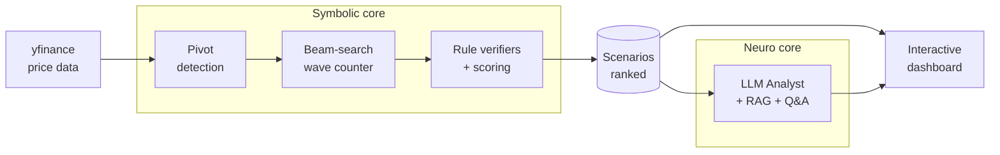

<div align="center">

# 🌊 Neuro-Symbolic AI for Elliott Wave Analysis

**Rule-based wave counting you can verify, explained by an LLM that cites the theory.**

**🌐 Live Demo:** [https://elliott-wave-web.vercel.app](https://elliott-wave-web.vercel.app)


[](https://github.com/nkieu-config/elliott-wave-ai-project/actions/workflows/ci.yml)


_Senior Project · Department of Computer Science, Thammasat University_

</div>

---

## Demo

<p align="center">
  
</p>

<table>
<tr>
<td width="50%" valign="top">
  <br>
  <sub><b>AI Reading</b> — streamed narration, every claim cites the theory</sub>
</td>
<td width="50%" valign="top">
  <br>
  <sub><b>Ask</b> — free-form theory Q&A, answered from <code>docs/</code> with citations</sub>
</td>
</tr>
</table>

## Overview

Counting Elliott waves is notoriously subjective — two analysts can label the same chart differently, and
most tools hand you a count with no way to check how they got there. This system analyzes the structure of
stock/asset markets using **Elliott Wave Theory** on a **neuro-symbolic** architecture that makes the
reading auditable: a rule-based (symbolic) wave counter that produces verifiable results, paired with a
large-language-model (neuro / LLM) analyst that explains those results and cites the underlying theory for
every statement it makes.

Everything surfaces through an interactive web dashboard: fetch price data → detect pivots → count waves
and rank hypotheses (scenarios) by a confidence score → draw them over the price chart → narrate the
reading with theory-grounded analysis, and answer free-form Elliott Wave theory questions on demand.

> [!IMPORTANT]
> **Not financial advice.** This is an educational / research project. Wave counts are algorithmic
> hypotheses and the AI narration is auto-generated — nothing here is investment advice or a recommendation
> to buy or sell any asset. Markets carry risk; do your own research.

## Highlights

- **A symbolic engine built from scratch.** ATR-based ZigZag pivot detection → beam search over wave
  hypotheses → rule verifiers (trend / sideway / 3-wave / link) → confidence scoring → wave-degree
  labeling — not a wrapper around an off-the-shelf indicator.
- **RAG-grounded LLM analyst.** Streams its reading over SSE in real time across four lenses
  (Structure / Outlook / Risk / Alternative), each statement linked to a retrieved theory passage, plus
  free-form Elliott Wave Q&A answered from the same corpus.
- **Full-stack.** Python engine + FastAPI (SSE streaming) backend + Next.js 15 / React 19
  dashboard with Lightweight Charts.
- **Production-minded.** **1,150+ tests** (1040 Python + 155 web) with branch coverage gated at ≥75%
  (actual ≈92%) in CI, `ruff` linting, an LRU-bounded parquet cache, response caching/failover for the
  LLM, and documented CORS / auth / scaling considerations.

## Table of Contents

**Overview** &nbsp;·&nbsp; [Demo](#demo) · [Overview](#overview) · [Highlights](#highlights) · [Architecture](#architecture-at-a-glance)

**Get started** &nbsp;·&nbsp; [Quick Start (Docker)](#quick-start-docker) · [Prerequisites](#prerequisites) · [Installation](#installation) · [Configuration](#configuration) · [Running](#running) · [Usage](#usage)

**Reference** &nbsp;·&nbsp; [Directory Tree](#directory-tree) · [Testing](#testing) · [Environment Variables](#environment-variables) · [Deployment & Scaling](#deployment--scaling) · [License](#license) · [Project Info](#project-info)

## Architecture at a Glance



| Layer                               | Technology                                    | Responsibility                                                                       |
| ----------------------------------- | --------------------------------------------- | ------------------------------------------------------------------------------------ |
| **Symbolic core** (`engine/`) | Python, pandas, numpy                         | Detect pivots (ZigZag/ATR) → count waves via beam search → verify rules → score      |
| **Neuro core** (`analyst/`)         | Ollama Cloud (LLM) + RAG                      | Explain hypotheses + answer theory Q&A in plain language, citing theory from `docs/` |
| **Backend** (`apps/api/`)           | FastAPI + uvicorn                             | REST API + SSE narration stream + theory Q&A (port 8000)                             |
| **Frontend** (`apps/web/`)          | Next.js 15 + React 19 + Lightweight Charts v5 | Interactive dashboard (port 3000)                                                    |

## Quick Start (Docker)

The fastest way to run the whole stack — no Python, uv, or Node needed locally, only Docker:

```bash
git clone https://github.com/nkieu-config/elliott-wave-ai-project.git
cd elliott-wave-ai-project
docker compose up --build
```

Then open the **dashboard at http://localhost:3000** (API docs at http://localhost:8000/docs). The
backend builds from the repo root; the frontend is a multi-stage standalone image.

> [!NOTE]
> AI Reading + Ask need an Ollama Cloud key (chart / scoring / KPI work without one — see the
> [Prerequisites note](#prerequisites)). For the container, compose reads `OLLAMA_API_KEY` from your shell
> or the project `.env`:
>
> ```bash
> export OLLAMA_API_KEY=<your key>   # or: cp .env.example .env && edit it
> docker compose up --build
> ```

Prefer running without containers? Follow [Prerequisites](#prerequisites) → [Installation](#installation)
for the local dev setup below.

## Prerequisites

> For the one-command container path, skip this section and see [Quick Start (Docker)](#quick-start-docker)
> — the steps below are for running directly on your machine (local development).

Install the following before you start:

| Software                 | Version      | Notes                                                                                                     |
| ------------------------ | ------------ | --------------------------------------------------------------------------------------------------------- |
| **Python**               | ≥ 3.11       | uv manages the version and environment for you                                                            |
| **uv**                   | ≥ 0.4        | Python package manager — see the [install guide](https://docs.astral.sh/uv/getting-started/installation/) |
| **Node.js**              | ≥ 20         | Developed on v22; ships with npm (`package.json` engines pin ≥ 20)                                        |
| **Internet**             | Required     | For yfinance price data + Ollama Cloud                                                                    |
| **Ollama Cloud API key** | _(optional)_ | Needed only for the AI Analyst — [get a key](https://ollama.com/settings/keys)                            |

> [!NOTE]
> Without an Ollama Cloud API key the chart / KPI / scoring features work normally — only **AI Reading**
> and **Ask** need an LLM (or a local [Ollama](https://ollama.com) running the fallback model, to which the
> analyst fails over automatically). **Ask** also needs `ANALYST_QA=1` plus the `grounding` extra — see
> [Environment Variables](#environment-variables).

## Installation

```bash
# 1) Clone the project
git clone https://github.com/nkieu-config/elliott-wave-ai-project.git
cd elliott-wave-ai-project

# 2) Install Python dependencies (uv creates .venv and installs from uv.lock)
uv sync --extra api

# 3) Install frontend dependencies
cd apps/web
npm install
cd ../..
```

## Configuration

```bash
# Copy the example file, then fill in your values
cp .env.example .env
```

Edit `.env` and add your Ollama Cloud API key:

```
OLLAMA_API_KEY=<your key from https://ollama.com/settings/keys>
```

The frontend calls `http://localhost:8000` by default, so no extra setup is needed for local
development. To point it at a different API, create `apps/web/.env.local` (this file is git-ignored):

```
NEXT_PUBLIC_API_URL=https://your-api-host
```

## Running

Open two terminals:

```bash
# Terminal 1 — Backend (port 8000)
uv run uvicorn apps.api.main:app --reload --port 8000
```

```bash
# Terminal 2 — Frontend (port 3000)
cd apps/web
npm run dev
```

Then open your browser:

- **Dashboard:** http://localhost:3000
- **API docs (Swagger UI):** http://localhost:8000/docs

## Usage

1. Open http://localhost:3000 — the app loads a default view (symbol `DDOG`, weekly, max range).
   The first load fetches live data from yfinance and caches it under `data/` automatically;
   subsequent loads read from the cache and appear instantly.
2. Choose a **symbol / period / timeframe** to fetch and re-analyze. Any symbol not yet cached is
   fetched live from yfinance.
3. The system ranks **wave-counting hypotheses (scenarios)** by a confidence score; inspect them one at a
   time and open a scenario to see its **score breakdown** (where the confidence comes from).
4. Toggle display layers (raw / trendline / latest) on the chart, then read the **AI Reading** panel,
   which streams a narration in real time (with theory citations) across four lenses:
   - **Structure** — what the current count is
   - **Outlook** — targets and the conditions that confirm them
   - **Risk** — the weakest link / invalidation
   - **Alternative** — the runner-up scenarios if this count is wrong
5. Press **`/`** or click **Ask** in the AI Reading header to ask a free-form Elliott Wave theory
   question — answered from `docs/` with citations, optionally grounded in the selected scenario
   (requires `ANALYST_QA=1`; see [Environment Variables](#environment-variables)).

## Directory Tree

```
elliott-wave-ai-project/
├── README.md                     # This guide
├── pyproject.toml                # Python package definition + dependencies (managed by uv)
├── uv.lock                       # Pinned dependency versions for reproducible installs
├── .env.example                  # Example configuration (copy to .env and fill in)
├── docker-compose.yml            # One-command full-stack run (api + web)
│
├── engine/                       # ── Symbolic core: rule-based Elliott Wave counter ──
│   ├── pivot.py                  #    Pivot detection (ATR-based ZigZag pivots)
│   ├── anchor.py                 #    Wave start selection (anchor)
│   ├── adaptive.py               #    Wave pattern families (3-wave / 5-wave trend / sideway)
│   ├── pipeline.py               #    Orchestration: pivots → anchor → wave counting
│   ├── parser/                   #    Beam-search wave counter + scoring
│   ├── verifiers/                #    Wave-rule checkers (trend / sideway / 3-wave / link)
│   ├── degree/                   #    Wave degree labeling (hierarchy)
│   └── data/                     #    Price fetch from yfinance + .parquet caching
│
├── analyst/                      # ── Neuro core: LLM-powered analyst ──
│   ├── orchestrator.py           #    Main coordinator (Analyst) + default singleton factory
│   ├── diagnostics/              #    Deterministic Layer-1: targets / bottlenecks / confirmation / decision / succession
│   ├── client/                   #    Ollama Cloud+local client (failover) + response cache + grounding gate
│   ├── theory/                   #    Theory retrieval (RAG): chunker / embedder / retriever from docs/
│   ├── prompts/                  #    Prompt templates: 4 narration modes + theory Q&A + repair
│   └── schemas/ , serialization/ #    Result schemas + LLM input serialization
│
├── apps/
│   ├── api/                      # Backend: FastAPI — routers/ (pipeline, analyst, qa, health),
│   │                             #          services/, schemas.py, serializers.py, dependencies.py
│   │                             #          + Dockerfile (image built from repo root)
│   └── web/                      # Frontend: Next.js 15 + React 19 (app/, components/, lib/)
│                                 #          + Dockerfile (multi-stage standalone build)
│
├── data/                         # Price cache (.parquet) — created automatically from yfinance
├── docs/                         # Elliott Wave theory document (EN), used as the RAG corpus
└── tests/                        # pytest suite (engine / analyst / apps)
```

## Testing

```bash
# Python
uv sync --extra api --extra dev   # install the test toolchain (first time only)
uv run pytest -m "not slow"       # fast tests
uv run pytest                     # full suite

# Frontend
cd apps/web
npm test
```

> CI runs the same checks on every push/PR — `ruff` + `pytest` (branch coverage ≥ 75%) and
> `tsc` + `eslint` + `vitest` — see [`.github/workflows/ci.yml`](.github/workflows/ci.yml).

## Environment Variables

<details>
<summary><b>⚙️ Click to expand the full variable reference</b></summary>

| Variable                    | Scope   | Default                 | Description                                                                                             |
| --------------------------- | ------- | ----------------------- | ------------------------------------------------------------------------------------------------------- |
| `OLLAMA_API_KEY`            | analyst | _(required for AI)_     | Ollama Cloud API key                                                                                    |
| `OLLAMA_PRIMARY_MODEL`      | analyst | `qwen3-next:80b-cloud`  | Primary model (cloud)                                                                                   |
| `OLLAMA_FALLBACK_MODEL`     | analyst | `qwen3.5:9b`            | Fallback model (local Ollama), used if the cloud call fails                                             |
| `ANALYST_QA`                | analyst | _(off)_                 | Set to `1` to enable the **Ask** theory Q&A (embedding retrieval; requires `uv sync --extra api --extra grounding`) |
| `ANALYST_GROUNDING_CHECK`   | analyst | _(off)_                 | Set to `1` to enable the grounding check (requires `uv sync --extra api --extra grounding`, pulls ~440MB torch)     |
| `EWL_API_CORS_ORIGINS`      | api     | _(dev regex)_           | Comma-separated allowlist of origins for production                                                     |
| `EWL_ENV`                   | api     | _(unset)_               | Set to `production` to warn loudly when `EWL_API_CORS_ORIGINS` is missing                               |
| `EWL_DISABLE_FORCE_REFRESH` | api     | _(off)_                 | Set to `1` to disable force-refresh (prevents cache bypass that burns LLM calls on public deploys)      |
| `EWL_CACHE_DIR`             | engine  | `<repo>/data`           | Directory for the price parquet cache                                                                   |
| `EWL_CACHE_MAX_BYTES`       | engine  | `268435456` (256MB)     | LRU budget for the parquet cache; over budget evicts oldest-fetched files first; `0` disables eviction  |
| `NEXT_PUBLIC_API_URL`       | web     | `http://localhost:8000` | API address the frontend calls                                                                          |

Normally only `OLLAMA_API_KEY` (and `EWL_API_CORS_ORIGINS` when deploying) need setting; the rest have
working defaults. Finer knobs — Ollama timeouts / retries / concurrency, logging, Sentry DSNs — also read
from the environment; see [`ollama_client.py`](analyst/client/ollama_client.py),
[`logging_config.py`](engine/logging_config.py), and `apps/web/sentry.*.config.ts`.

</details>

## Deployment & Scaling

For production, this system is designed to be deployed as separated services. The current live architecture uses **Vercel** for the Next.js frontend and **Render** for the Python FastAPI backend.

### 1. Frontend (Vercel)
- **Framework Preset**: Next.js
- **Root Directory**: `apps/web` (critical: must be set before deploying)
- **Environment Variables**:
  - `NEXT_PUBLIC_API_URL` = `https://<your-render-api-url>.onrender.com`

### 2. Backend (Render / Docker)
Deploy the repository root (`.`) as a Docker Web Service, pointing to `apps/api/Dockerfile`.
- **Environment Variables**:
  - `EWL_ENV=production` (Enforces CORS and hides OpenAPI docs)
  - `EWL_API_CORS_ORIGINS=https://<your-vercel-frontend-url>.vercel.app`
  - `EWL_CACHE_DIR=/app/data/.cache` (Points the caching engine to the writable volume in the Docker container)
  - `OLLAMA_API_KEY` = `<your-key>`

> [!IMPORTANT]
> **Run one worker per process.** In-process caches aren't shared across workers, so `uvicorn --workers N`
> causes cross-worker cache misses. To scale, use a sticky-routing reverse proxy or move caches to Redis.

> [!WARNING]
> **CORS, auth & exposure (production).** Ensure `EWL_API_CORS_ORIGINS` is set correctly. Endpoints have no
> app-level auth and no rate limiting. Set `EWL_DISABLE_FORCE_REFRESH=1` to block the cache bypass that burns LLM calls.

## License

© 2026 Natthachak Juengrakseraochai. All rights reserved.

Published as an academic / portfolio project — you're welcome to read and learn from the code, but it is
not licensed for redistribution or commercial use without permission.

## Project Info

|                  |                                                                                       |
| ---------------- | ------------------------------------------------------------------------------------- |
| **Project Code** | 68-1_24_pps-r1                                                                        |
| **Title (TH)**   | ระบบปัญญาประดิษฐ์แบบนิวโร-ซิมบอลิกเพื่อการวิเคราะห์โครงสร้างตลาดตามทฤษฎีคลื่นเอลเลียต |
| **Title (EN)**   | A Neuro-Symbolic AI System for Market Structure Analysis Based on Elliott Wave Theory |
| **Author**       | Mr. Natthachak Juengrakseraochai                                                      |
| **Advisor**      | Asst. Prof. Dr. Pokpong Songmuang                                                     |

Developed as a final project for the Department of Computer Science, Thammasat University.
