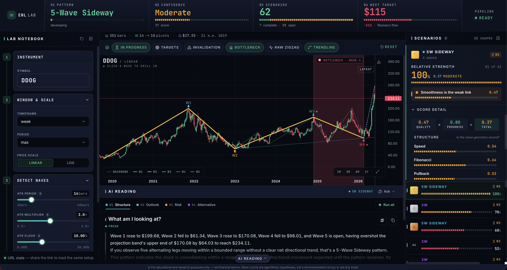
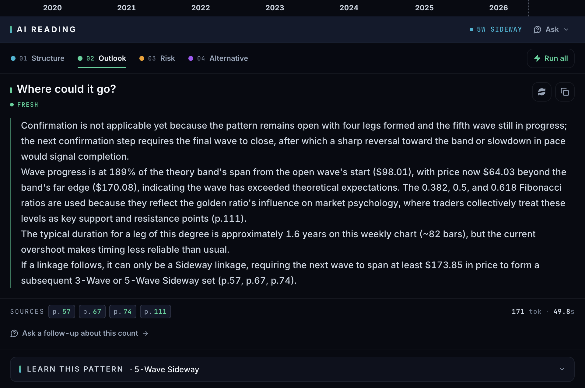
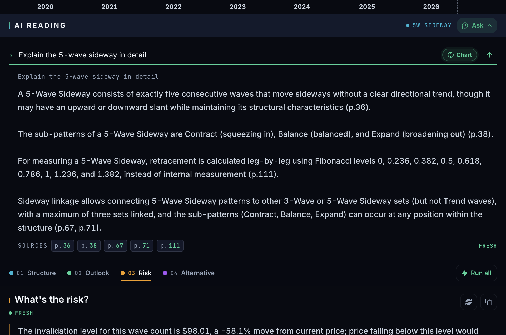
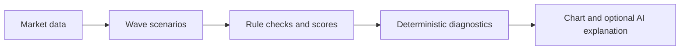

<div align="center">

# 🌊 Elliott Wave Lab

**An auditable neuro-symbolic system for exploring Elliott Wave structures.**

[](https://github.com/nkieu-config/elliott-wave-engine/actions/workflows/ci.yml)
[](https://elliott-wave-web.vercel.app)
[](LICENSE)


[Live demo](https://elliott-wave-web.vercel.app) · [Quick start](#quick-start) · [Documentation](#documentation)

**A full-stack capstone project that turns Elliott Wave analysis into something people can inspect, question, and understand.**

_Senior Project · Department of Computer Science, Thammasat University_

</div>

---

<p align="center">
  
</p>
<p align="center">
  <sub><b>Product tour</b> — explore wave scenarios, inspect rule results, drill into sub-waves, and read the optional AI explanation</sub>
</p>

## What is this?

Elliott Wave analysis often depends on the analyst's interpretation. Different analysts can label
the same chart differently, while many tools show a result without explaining how it was produced.

Elliott Wave Lab explores a more transparent approach. It takes market data, proposes possible wave
structures, checks them against explicit rules, and displays the reasoning behind each result. An
optional AI layer explains the computed output in plain language and links theory claims to the
retrieved source pages.

The system is designed as an educational and research artifact. The AI explains the analysis; it
does not change the wave count or calculate financial values.

## Try the demo

**Open the [live demo](https://elliott-wave-web.vercel.app)** — no signup required.

1. Choose a symbol, timeframe, and data range.
2. Compare the ranked wave scenarios and open a score breakdown.
3. Click a wave label to explore nested sub-waves, then open **AI Reading** for a guided explanation.

The hosted demo runs on free tiers, so the first request may take a little time while the API wakes
up or fetches uncached market data. The chart, scoring, and key metrics work without an Ollama API
key; AI Reading and Ask need an LLM configuration.

> [!CAUTION]
> This is not financial advice. Wave counts are algorithmic hypotheses and AI-generated text may
> be incomplete or incorrect. Use the project for learning and research only.

## Main features

| Feature | What you can do |
| --- | --- |
| Wave scenarios | Explore multiple possible interpretations instead of receiving one unexplained answer. |
| Rule trail | Inspect the rules, measurements, and pass/fail results behind each scenario. |
| Interactive chart | View wave overlays, Fibonacci levels, confirmation levels, invalidation levels, and nested sub-waves. |
| Scenario comparison | See what separates the strongest candidates and where each one is weakest. |
| AI Reading | Read four guided views of the computed result with citations to the theory corpus. |
| Ask | Ask questions about Elliott Wave theory using the local theory corpus. |
| Shareable state | Share a URL that preserves the selected scenario, chart layers, and drill-down state. |

## Screenshots

<p align="center">
  
</p>
<p align="center">
  <sub><b>Dashboard</b> — interactive chart, wave overlay, ranked scenarios, and score breakdown</sub>
</p>

| AI Reading | Ask |
| --- | --- |
|  |  |

## How it works


```mermaid
flowchart LR
    A[Market data] --> B[Wave scenarios]
    B --> C[Rule checks and scores]
    C --> D[Deterministic diagnostics]
    D --> E[Chart and optional AI explanation]
```

1. **Collect data** — load price bars from the market-data source or local cache.
2. **Find scenarios** — generate possible wave structures and check them against the theory rules.
3. **Compute diagnostics** — calculate scores, targets, confirmation levels, invalidation levels, and risk figures deterministically.
4. **Explain the result** — show the output in the dashboard and optionally let the AI narrate it with theory citations.

For the implementation details, see [Architecture Deep Dive](docs/architecture.md).

## Tech stack

| Layer | Technologies | Responsibility |
| --- | --- | --- |
| Wave engine | Python, pandas, NumPy | Detect pivots, build wave scenarios, verify rules, and score results |
| Analyst | Python, Ollama, retrieval | Compute diagnostics and explain results with the theory corpus |
| Backend | FastAPI, Uvicorn | Serve analysis results, AI narration, and theory Q&A |
| Frontend | Next.js, React, TypeScript, Lightweight Charts | Provide the interactive dashboard |
| Quality | pytest, Vitest, Ruff, mypy, import-linter, GitHub Actions | Test behavior, code quality, and architecture boundaries |

## Quick start

Docker is the simplest way to run the full stack:

```bash
git clone https://github.com/nkieu-config/elliott-wave-engine.git
cd elliott-wave-engine
docker compose up --build
```

Open the following URLs after the services start:

- Dashboard: <http://localhost:3000>
- API documentation: <http://localhost:8000/docs>

To enable AI Reading, copy `.env.example` to `.env` and add an `OLLAMA_API_KEY`. The chart and
scoring features remain available without it.

For local Python and Node.js setup, environment variables, API usage, testing, and deployment, see
[Development & Deployment Guide](docs/development.md).

## Project structure

```text
engine/       Rule-based Elliott Wave engine
analyst/      Deterministic diagnostics and AI narration
infra/        Market-data and LLM adapters
apps/api/     FastAPI application
apps/web/     Next.js dashboard
docs/         Architecture, examples, development, and tradeoffs
```

## Quality checks

Continuous integration checks the Python and frontend code, verifies the architecture boundaries,
runs the test suites, builds the Docker images, and checks dependency health. The commands and
coverage configuration are documented in [Development & Deployment Guide](docs/development.md).

## Documentation

| Document | Best for |
| --- | --- |
| [Architecture Deep Dive](docs/architecture.md) | Understanding the wave engine, diagnostics, AI grounding, caching, streaming, and frontend design |
| [Worked Examples](docs/examples.md) | Seeing real outputs, score behavior, low-confidence results, and empty results |
| [Development & Deployment Guide](docs/development.md) | Installing dependencies, running services, calling the API, testing, and deploying |
| [Design Tradeoffs & Known Limitations](docs/tradeoffs.md) | Understanding important design decisions, alternatives, constraints, and future work |

## Limitations

- The output is auditable, but it is not benchmarked against a labeled dataset of expert wave counts.
- The system uses yfinance as a best-effort data source for the demo.
- The AI can explain a computed scenario, but it cannot improve or replace the rule-based count.
- The default deployment uses single-process caches and is intended for portfolio and research use.

More context and the trade-offs behind these decisions are documented in
[Design Tradeoffs & Known Limitations](docs/tradeoffs.md).

## Capstone context

Built solo by [Natthachak Jeungraksareechai](https://github.com/nkieu-config) as a final project for
the Department of Computer Science, Thammasat University.

| Project | 68-1_24_pps-r1 |
| --- | --- |
| Thai title | ระบบปัญญาประดิษฐ์แบบนิวโร-ซิมบอลิกเพื่อการวิเคราะห์โครงสร้างตลาดตามทฤษฎีคลื่นเอลเลียต |
| English title | A Neuro-Symbolic AI System for Market Structure Analysis Based on Elliott Wave Theory |
| Advisor | Asst. Prof. Dr. Pokpong Songmuang |

Contact: [LinkedIn](https://www.linkedin.com/in/natthachak) · [GitHub](https://github.com/nkieu-config)

Usage terms are defined in [LICENSE](LICENSE). This repository is published as a work sample for
reading, study, and portfolio review.
