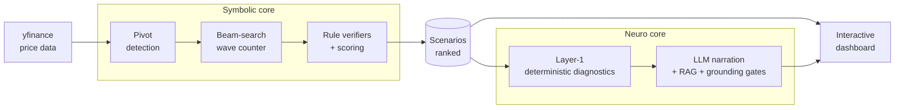

# Architecture Deep Dive

How the system works under the hood — the symbolic wave-counting engine, the LLM analyst and its
anti-hallucination defenses, the API layer, and the web dashboard.

> Looking for setup instructions instead? See [development.md](development.md).

## Contents

- [Where to start reading](#where-to-start-reading)
- [System overview](#system-overview)
- [Symbolic core (`engine/`)](#symbolic-core-engine)
- [Neuro core (`analyst/`)](#neuro-core-analyst)
- [Anti-hallucination defenses](#anti-hallucination-defenses)
- [Adapters (`infra/`)](#adapters-infra)
- [Backend (`apps/api/`)](#backend-appsapi)
- [Frontend (`apps/web/`)](#frontend-appsweb)
- [Performance engineering](#performance-engineering)
- [Testing & architecture discipline](#testing--architecture-discipline)

## Where to start reading

If you'd rather read the code than a description of it, these eight files are the ones worth your
time — in an order where each builds on the last, and with what to look for once you're there.

1. **[`engine/pipeline.py`](../engine/pipeline.py)** — the whole system on one page. The count
   cache keys on pivot identity *plus a digest of the bar OHLC data*, so revised price data can
   never serve a stale count.
2. **[`engine/pivot.py`](../engine/pivot.py)** — a causal ATR ZigZag: `ATR[i]` uses only bars
   `0..i`, because the last bar of a live chart is still forming. The interest is in how
   explicitly each edge case is handled.
3. **[`engine/parser/engine/branching.py`](../engine/parser/engine/branching.py)** — each
   hypothesis branches exactly three ways per segment (extend / open a sub-wave / close into the
   parent). The recursive wave grammar falls out of those three options.
4. **[`analyst/schemas/narration.py`](../analyst/schemas/narration.py)** — the central trick.
   The retrieved theory pages are baked into an `enum` on the citation field *per request*, so
   citing a page the retriever never supplied is impossible at decode time, not merely detected
   afterwards.
5. **[`analyst/client/grounding.py`](../analyst/client/grounding.py)** — the two checks the
   schema can't express: fabricated numbers (matched on digit boundaries, so a real `3450` does
   not excuse an invented `450`) and leaked identifiers.
6. **[`infra/llm/ollama_client.py`](../infra/llm/ollama_client.py)** — cloud-primary with local
   failover. Note that response parsing sits *outside* the failover try-block: a malformed-but-200
   response surfaces as a bug instead of being absorbed by the fallback.
7. **[`apps/api/routers/analyst.py`](../apps/api/routers/analyst.py)** — SSE streaming that
   refuses to fake liveness. Typewriter pacing is skipped entirely for cache hits and fallbacks.
8. **[`tests/apps/test_web_parity.py`](../tests/apps/test_web_parity.py)** — ~50 lines that pin
   the frontend's TypeScript defaults key-for-key to the backend's Pydantic model, so web/API
   drift fails CI instead of shipping.

## System overview



The design principle throughout: **everything numeric is computed deterministically; the LLM only
narrates**. The symbolic engine produces rule-checked, scored wave scenarios. A deterministic
diagnostics layer (Layer-1) derives every target, invalidation level, and risk figure. The LLM's
job is limited to explaining that pre-computed block in plain language, with each statement
citing a retrieved theory passage — and multiple independent gates verify it did exactly that.

## Symbolic core (`engine/`)

Pipeline entry: [`engine/pipeline.py`](../engine/pipeline.py). Flow:
`bars → ATR ZigZag pivots → min-bar spacing → anchor → beam-search wave count → immutable PipelineResult`.

### Pivot detection — causal ATR ZigZag

[`engine/pivot.py`](../engine/pivot.py) finds alternating high/low pivots where the reversal
threshold adapts per-bar to volatility:

```
threshold(i) = max(atr_multiplier × ATR[i] / close[i], floor_threshold)
```

Defaults: ATR period 14, multiplier 3.0, floor 10%. The floor guards calm regimes where ATR → 0.

Details that matter for live data:

- **Causal ATR** — `ATR[i]` uses only bars `0..i` (`TR[0] = high − low`). No look-ahead, because
  the last bar of a live chart is still forming.
- **Bootstrap phase** — the first threshold break fixes the *opposite* extreme as pivot 0.
- **Outside bars** that break both ways resolve to the larger excess.
- `enforce_min_bars` iteratively drops the right pivot of too-short pairs and collapses same-kind
  adjacents until stable.

### Anchor selection

[`engine/anchor.py`](../engine/anchor.py) picks the wave origin: the lowest low among active
pivots, ties broken to the earliest occurrence (longest downstream analysis window).

### Beam-search wave counter

[`engine/parser/api.py`](../engine/parser/api.py) runs a beam search over wave hypotheses
(`BEAM_WIDTH = 500`, hard timeout 30s, max nesting depth 8). Per price segment, each hypothesis
can branch three ways ([`engine/parser/engine/branching.py`](../engine/parser/engine/branching.py)):

- **Extend** the current context with another leg
- **Open** a nested sub-wave (the grammar is recursive — waves contain waves)
- **Close** the top context into its parent, then branch

The sub-pattern grammar (which families may nest inside which) is data-driven in
[`engine/adaptive.py`](../engine/adaptive.py).

### Scoring — weakest-link, not weighted sum

[`engine/parser/scoring/components.py`](../engine/parser/scoring/components.py) scores each
hypothesis as `min(structural_total, visual_total)`, where each dimension is itself the **min of
its slot scores**. A hypothesis can't buy its way past one broken property with excellence
elsewhere — the same way a human analyst discards a count with a single fatal flaw.

| Dimension  | Slot                    | What it measures                                                |
| ---------- | ----------------------- | ---------------------------------------------------------------- |
| Structural | `speed_cluster`         | Consistency of leg pace (log-CV)                                 |
| Structural | `fib_push_pairs`        | Push-size ratios' log-space distance to Fibonacci levels         |
| Structural | `pull_depth_discipline` | Retracement depth plateau in [0.382, 0.618], exp-decay outside   |
| Visual     | `pivot_sharpness`       | Candle body size vs leg pace around each pivot                   |
| Visual     | `leg_smoothness`        | 1 − max intra-leg counter-drawdown / leg length                  |

Display scores multiply in a **commitment factor** (`legs / min_legs_to_complete`) so a one-leg
hypothesis can't outrank a committed count — but the beam hot path skips it, so short hypotheses
survive long enough to grow. Ranking uses a deterministic total order `(-score, content-hash)` so
results are stable regardless of upstream ordering.

### Rule verifiers

[`engine/verifiers/`](../engine/verifiers/) classifies each candidate pattern and returns explicit
per-rule pass/fail results (`PatternKind`, `list[RuleResult]`) — this is what makes every count
auditable in the UI:

- **5-wave trend** (`trend.py`) — count/alternation, odd-legs-push, even-legs-pull, wave-3 larger
  than wave-2, **wave-3 never the shortest**, retracement caps, minimum wave-5 size, and subtype
  classification (longest-1/3/5, equal-push, shortened-5th).
- **3-wave correction** (`three.py`) — retracement range and minimum third-leg size.
- **5-wave sideway** (`sideway.py`) — Contract / Balance / Expand subtypes.
- **Link waves** (`link_t.py`, `link_s.py`) — compound connector structures between patterns.

### Degree labeling

[`engine/degree/`](../engine/degree/) recursively assigns wave degrees
(PRIMARY → SECONDARY → MINOR) down the wave tree. A **Gann-band same-degree gate** rejects legs
more than 3× out of proportion with prior same-context legs — measured on the time axis for
trending families and the price axis for the rest.

## Neuro core (`analyst/`)

Orchestrator: [`analyst/orchestrator.py`](../analyst/orchestrator.py). Two layers:

### Layer-1 — deterministic diagnostics (no LLM)

[`analyst/diagnostics/`](../analyst/diagnostics/) computes everything numeric before any LLM is
involved:

- `bottleneck.py` — which scoring slot is the weakest link, explained in plain language
- `confirmation.py` — family-specific confirmation levels (L1–L4) with theory-page citations
- `targets.py` — Fibonacci-flow price targets, confirmation and invalidation levels
- `decision.py` — stage/progress, projection band, risk-reward
- `succession.py` — which patterns can legally follow the current one
- `scenario_diff.py` — what separates the top-ranked scenarios

### Layer-2 — RAG-grounded narration

Four narration lenses, each a distinct prompt over the same Layer-1 block, streamed to the UI in
parallel. The UI label, the wire `mode`, and the prompt module are three different names for the
same lens:

| UI lens         | Wire `mode`      | Prompt module                  | Answers                      |
| --------------- | ---------------- | ------------------------------ | ---------------------------- |
| **Structure**   | `explanation`    | `prompts/explanation.py`       | What am I looking at?        |
| **Outlook**     | `outlook`        | `prompts/scenario_outlook.py`  | Where could it go?           |
| **Risk**        | `risk`           | `prompts/slot_focus.py`        | What's the weakest link?     |
| **Alternative** | `differentiator` | `prompts/differentiator.py`    | What if this count is wrong? |

Retrieval ([`analyst/theory/`](../analyst/theory/)):

- **Corpus** — the theory document in
  [`analyst/theory/corpus/`](../analyst/theory/corpus/elliott_wave_theory_en.md), chunked
  one-per-page (98 pages). It lives beside the code that reads it: `make_embeddings.py` turns it
  into the prebuilt index in `analyst/theory/data/`, which is what ships and what the retriever
  loads at runtime.
- **Embedder** — `BAAI/bge-base-en-v1.5` (768-dim), with the HuggingFace revision **pinned to a
  SHA** so a silent upstream force-push can't shift the embedding space under the prebuilt index.
- **Two retrieval modes** — narration uses a deterministic slot→page map (each prompt mode gets
  exactly the pages relevant to its scenario family); free-form Q&A uses cosine similarity.
- **Alias enrichment** — the theory uses coined codes (`+T`, `LINK_T`) that natural-language
  queries never contain, so the chunker appends a terminology footer expanding them. Measured
  effect: the key link-wave page jumped from rank 16 to rank 2 for a natural-language query.
- **Out-of-scope gate** — Q&A refuses off-topic questions *before* spending an LLM call, using a
  cosine threshold (0.56) calibrated on a labeled in/out question set with clean separation
  (in-scope min 0.607 vs out-of-scope max 0.546).

### LLM client — failover, throttling, caching

The `LLMClient` port lives here ([`analyst/client/base.py`](../analyst/client/base.py)); its
adapter lives in [`infra/llm/ollama_client.py`](../infra/llm/ollama_client.py), which supplies:

- A cloud primary model → automatic failover to a local Ollama fallback. Only a
  curated set of transport/API exceptions triggers failover — programming errors surface as bugs.
  Both models are overridable per deployment; the current defaults are listed in the
  [environment-variable reference](development.md#environment-variables).
- A `BoundedSemaphore` serializes concurrent cloud calls (four narration modes firing at once
  reliably drew 429s from the cloud endpoint).
- Bounded timeouts (the client library's default of `None` freezes the UI), exponential-backoff
  retry, fixed seed + low temperature for reproducible narration.

[`analyst/client/cache.py`](../analyst/client/cache.py):

- Disk cache with atomic tempfile+rename writes and LRU eviction (256MB budget).
- **Content-derived cache keys** — SHA256 over family + pattern kind + score components + anchor,
  so a cache entry survives parser-side UUID regeneration.
- **Pipeline fingerprint** ([`analyst/_fingerprint.py`](../analyst/_fingerprint.py)) — SHA256 over
  all source files *and* the RAG corpus artifacts, so rebuilding the corpus with a new embedding
  model invalidates stale narrations even though no `.py` changed.
- Transient LLM-unavailable results are never cached (that would pin a degraded reading);
  deterministic gate-fallback text is.

## Anti-hallucination defenses

The central engineering problem: an LLM narrating financial analysis must not invent numbers,
rules, or citations. Five independent mechanisms, in order of when they act:

1. **Typed-claim schema** ([`analyst/schemas/narration.py`](../analyst/schemas/narration.py)) —
   the LLM must emit structured output where every claim is typed
   (`data_observation` / `theory_claim` / `disclosure`), not free prose.
2. **Dynamic citation enum** — the JSON schema's `pages` field is generated per-request as an enum
   of the pages actually retrieved. Citing a page the retriever didn't supply is *structurally
   impossible*, not merely checked after the fact.
3. **Fabricated-number check** ([`analyst/client/grounding.py`](../analyst/client/grounding.py)) —
   every number in a `data_observation` must appear verbatim in the Layer-1 block (with
   number-boundary matching, so "450" isn't masked by "3450").
4. **Citation gate** ([`analyst/client/gate.py`](../analyst/client/gate.py)) — pattern checks for
   leaked internal identifiers, arithmetic chains, meta-system jargon, and fragments. Hard
   failures fall back to deterministic Layer-1 text rather than shipping a suspect narration.
5. **Semantic grounding (advisory, opt-in)** — each `theory_claim` is re-embedded and compared
   against its cited page; flagged when similarity and rank both fall below calibrated bounds.

A **one-shot repair loop** retries generation once on soft flags — keeping the original unless
the repair is strictly cleaner, so a passing reading never regresses.

## Adapters (`infra/`)

Everything that touches the outside world lives here, behind a Protocol the inner layer owns:

| Port (declared by) | Adapter (`infra/`) | Talks to |
| --- | --- | --- |
| `BarSource` ([`engine/data/source.py`](../engine/data/source.py)) | `YFinanceSource` | yfinance |
| `BarCache` ([`engine/data/cache.py`](../engine/data/cache.py)) | `ParquetCache` | parquet on disk |
| `LLMClient` ([`analyst/client/base.py`](../analyst/client/base.py)) | `OllamaClient` | Ollama cloud/local |

Both market-data ports speak `Sequence[Bar]`, the engine's own type — so `pandas` is confined to
[`infra/market_data/_frames.py`](../infra/market_data/_frames.py), which converts at the boundary.
`BarRepository` orchestrates cache-then-source purely in domain terms.

Nothing constructs an adapter except [`apps/api/pipeline_ops.py`](../apps/api/pipeline_ops.py)
(bar repository) and [`apps/api/services/analyst_service.py`](../apps/api/services/analyst_service.py)
(analyst + LLM client). Those two functions are the composition root, and the only place
`EWL_CACHE_DIR`, `EWL_CACHE_MAX_BYTES`, `ANALYST_QA` and `ANALYST_GROUNDING_CHECK` are read.

## Backend (`apps/api/`)

- **Routers** — `pipeline` (analysis + eager Layer-1 for the top scenario, saving a client
  roundtrip), `analyst` (SSE narration stream), `qa` (theory Q&A), `health`.
- **SSE streaming** ([`apps/api/routers/analyst.py`](../apps/api/routers/analyst.py)) — the
  blocking LLM call runs via `asyncio.to_thread`; the router paces tokens for a typewriter effect,
  but **skips pacing for cache hits and fallbacks** so the UI never fakes a live generation.
  `gen_ms` reports real LLM wall time, not playback time. Preflight validation runs before the
  stream opens so failures surface as HTTP status codes, not mid-stream errors.
- **Production hardening** ([`apps/api/main.py`](../apps/api/main.py)) — explicit CORS allowlist
  with **fail-fast startup** when production is configured without one; OpenAPI docs disabled in
  production; a force-refresh guard (`EWL_DISABLE_FORCE_REFRESH`) blocks the cache bypass that
  would let anonymous clients burn unbounded LLM calls.
- **Data layer** ([`infra/market_data/`](../infra/market_data/), behind the ports in
  [`engine/data/`](../engine/data/)) — yfinance fetch with exponential-backoff retry, parquet cache
  with per-timeframe TTLs each set *below* one bar period (day 12h / week 1d / month 3d) so a
  still-forming bar always refreshes, plus LRU eviction under a byte budget.

## Frontend (`apps/web/`)

Next.js 15 / React 19, Lightweight Charts v5.

- **Chart** ([`apps/web/components/chart/use-wave-chart.ts`](../apps/web/components/chart/use-wave-chart.ts)) —
  three cooperating hooks: chart instance (log/linear scale, zoom preserved across re-renders),
  **click-to-drill** into sub-waves (clicks map onto the containing leg span, since markers aren't
  natively clickable), and overlay drawing (wave lines, Fib/confirmation/invalidation price lines,
  a bottleneck band synced to the time scale, hover isolation dimming).
- **State** — Zustand for imperative UI state, **nuqs for URL-synced state**: selected scenario,
  drill path, compare mode, and chart layers all live in the URL, so sharing a link reproduces the
  exact chart configuration. TanStack Query for data fetching.
- **Narration** ([`apps/web/lib/hooks/use-narration-stream.ts`](../apps/web/lib/hooks/use-narration-stream.ts)) —
  four parallel SSE streams (one per lens), each with its own AbortController and per-mode state
  (status, tokens, citations, cached/fell-back provenance), with truncated-stream detection.
  SSE parsing is POST-based with CRLF normalization and trailing-UTF8 flush.
- **Ask overlay** — `/`-hotkey console for theory Q&A with citation chips, a theory-only vs
  scenario-grounded toggle, and screen-reader-aware focus handling.

## Performance engineering

Where it lands today (Apple M4, cached bars, `BEAM_WIDTH = 500`, defaults elsewhere):

| Chart                            | Bars  | Active pivots | Cold analysis | Memoized repeat |
| -------------------------------- | ----- | ------------- | ------------- | --------------- |
| AAPL weekly / max (back to 1980) | 2,379 | 94            | ~3.1s         | ~2ms            |
| DDOG weekly / max (demo default) | 356   | 12            | ~0.5s         | ~2ms            |
| AAPL daily / 2y                  | 501   | 13            | ~0.2s         | ~4ms            |

The repeat column is the wave-count LRU (keyed on pivot identity + config) — re-analysis without a
data change never re-runs the beam.

Documented, measured optimizations on the beam-search hot path:

- `copy.deepcopy` in hypothesis cloning measured at **94% of wall time** — replaced with targeted
  shallow copies of only the mutated lists.
- `@dataclass(slots=True)` on hypothesis/leg/context types — the beam allocates 100k+ objects on
  long charts, and `__dict__` added ~30% overhead.
- Hot/verbose scoring split — the beam path uses plain functions with no per-pair detail-dict
  allocation; verbose variants exist only for the score-breakdown display.
- Wave counting memoized via a thread-safe LRU keyed on pivot identity + config, with
  deepcopy-on-return to prevent cache poisoning.

## Testing & architecture discipline

- **Python** — a pytest suite mirroring the source structure (per-verifier, per-slot,
  per-diagnostic), plus parity tests that pin engine/gate/web behavior to each other. Branch
  coverage gated at ≥75% in CI; current counts and coverage live in the
  [README](../README.md#testing--quality).
- **Web** — Vitest cases covering chart helpers, SSE parsing, the narration stream, and stores,
  plus a dedicated render-profiling config for the reading pane.
- **CI** ([`.github/workflows/ci.yml`](../.github/workflows/ci.yml)) — Python 3.11 + 3.12 matrix,
  `ruff`, `mypy`, `lint-imports`, `pytest --cov` with the coverage gate, `tsc`, `eslint`,
  **`next build`** (catches RSC/static-generation failures that type checks miss), Vitest.
  Actions SHA-pinned.
- **Enforced layering** — [`import-linter`](https://import-linter.readthedocs.io) makes the
  architecture a CI failure, not a convention. One `layers` contract pins the whole stack:

  ```
  apps  →  infra  →  analyst  →  engine
  ```

  (interface → infrastructure → application → domain). Every upward import fails
  `lint-imports`, transitive ones included. ruff's banned-api rules stay on as a fast local
  echo of the same rule for `engine/**`.
- **Ports and adapters** — the inner layers declare Protocols (`BarSource`, `BarCache`,
  `LLMClient`) and never name a concrete implementation. `infra/` supplies the adapters
  (`YFinanceSource`, `ParquetCache`, `OllamaClient`); `apps/api` is the only composition root
  that wires them together, and the only layer that reads environment configuration. The ports
  speak the domain's own `Bar` type, so pandas never crosses into `engine/`.
